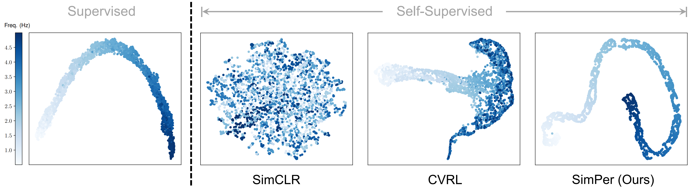

# SimPer: Simple Self-Supervised Learning of Periodic Targets

This repository contains the implementation code for paper: <br>
__[SimPer: Simple Self-Supervised Learning of Periodic Targets](https://arxiv.org/abs/2210.03115)__
___
<p align="center">
     <br>
</p>


## Brief Introduction for SimPer
From human physiology to environmental evolution, important processes in nature often exhibit meaningful and strong __periodic__ or __quasi-periodic__ changes. Due to their inherent label scarcity, learning useful representations for periodic tasks with limited or no supervision is of great benefit. Yet, existing self-supervised learning (SSL) methods overlook the intrinsic periodicity in data, and fail to learn representations that capture periodic or frequency attributes.

We present _SimPer_, a simple contrastive SSL regime for learning periodic information in data. To exploit the periodic inductive bias, SimPer introduces customized ___periodicity-invariant___ and ___periodicity-variant___ augmentations, ___periodic feature similarity measures___, and a ___generalized contrastive loss___ for learning efficient and robust periodic representations.

We benchmark SimPer on common real-world tasks in _human behavior analysis_, _environmental sensing_, and _healthcare_ domains. Further analysis also highlights its intriguing properties including better data efficiency, robustness to spurious correlations, and generalization to distribution shifts.


## Updates
- __[10/06/2022]__ [arXiv version](https://arxiv.org/abs/2210.03115) posted. The code is currently under cleaning. Please stay tuned for updates.


## Citation
```bib
@article{yang2022simper,
  title={SimPer: Simple Self-Supervised Learning of Periodic Targets},
  author={Yang, Yuzhe and Liu, Xin and Wu, Jiang and Borac, Silviu and Katabi, Dina and Poh, Ming-Zher and McDuff, Daniel},
  journal={arXiv preprint arXiv:2210.03115},
  year={2022}
}
```
